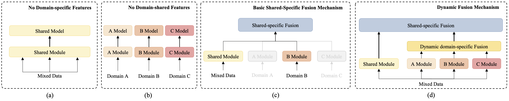
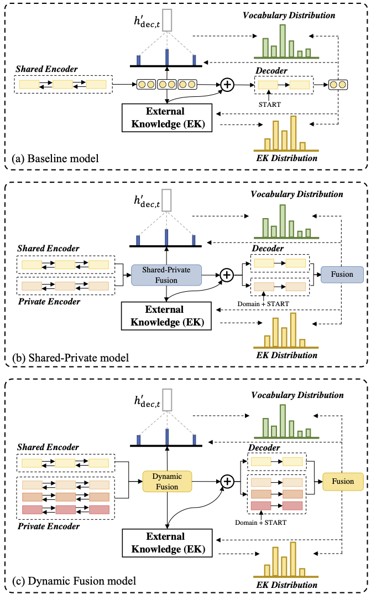
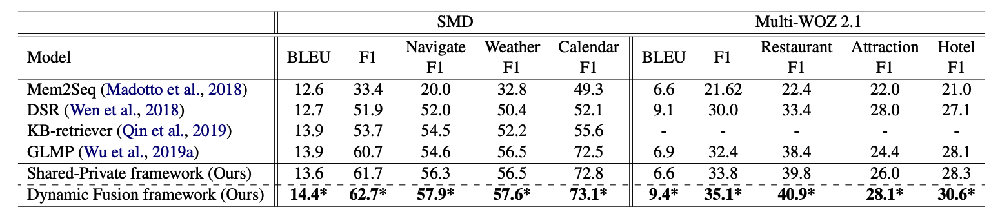

# Dynamic Fusion Network for Multi-Domain End-to-end Task-Oriented Dialog

This repository contains the PyTorch implementation of the paper: 

**Dynamic Fusion Network for Multi-Domain End-to-end Task-Oriented Dialog**. [Libo Qin](http://ir.hit.edu.cn/~lbqin/), [Xiao Xu](https://looperxx.github.io/), [Wanxiang Che](http://ir.hit.edu.cn/~car/chinese.htm), [Yue Zhang](https://frcchang.github.io/), [Ting Liu](http://ir.hit.edu.cn/~liuting/). ***ACL 2020***. [[PDF(Arxiv)]](https://arxiv.org/abs/2004.11019)

If you use any source codes or the datasets included in this toolkit in your work, please cite the following paper. The bibtex are listed below:

<pre>
......
</pre>


In the following, we will guide you how to use this repository step by step.

## Architecture

<div align=center></div>

## Results



## Preparation

Our code is based on PyTorch 1.2. Required python packages:

-   numpy==1.18.1
-   tqdm==4.32.1
-   torch==1.2.0

We highly suggest you using [Anaconda](https://www.anaconda.com/) to manage your python environment.

## How to Run it

The script **myTrain.py** acts as a main function to the project, you can run the experiments by the following commands.

```Shell
# SMD dataset
python myTrain.py -gpu=True -ds=kvr -dr=0.2 -bsz=16 -an=SMD -op=SMD.log
# MultiWOZ 2.1 dataset
python myTrain.py -gpu=True -ds=woz -dr=0.1 -bsz=32 -an=WOZ -op=WOZ.log
```

We also provide our reported model parameters in the `save/best` directory, you can run the following command to evaluate them and so on.

```SHELL
python myTrain.py -gpu=True -e=0 -ds=kvr -bsz=16 -path=save/best/SMD -op=SMD.log
python myTrain.py -gpu=True -e=0 -ds=woz -bsz=32 -path=save/best/MultiWOZ -op=WOZ.log
```

Due to some stochastic factors(e.g., GPU and environment), it maybe need to slightly tune the hyper-parameters using grid search to reproduce the results reported in our paper. All the hyper-parameters are in the `utils/config.py` and here are the suggested hyper-parameter settings:

-   Dropout ratio [0.1, 0.15, 0.2, 0.25, 0.3]
-   Batch size [16, 32]
-   Teacher forcing ratio [0.7, 0.8, 0.9, 1.0]

If you have any question, please issue the project or [email](mailto:xxu@ir.hit.edu.cn) me and we will reply you soon.

## Acknowledgement

**Global-to-local Memory Pointer Networks for Task-Oriented Dialogue**. [Chien-Sheng Wu](https://jasonwu0731.github.io/), [Richard Socher](https://www.socher.org/), [Caiming Xiong](http://www.stat.ucla.edu/~caiming/). ***ICLR 2019***. [[PDF]](https://arxiv.org/abs/1901.04713) [[Open Reivew]](https://openreview.net/forum?id=ryxnHhRqFm) [[Code]](https://github.com/jasonwu0731/GLMP)

>   We are highly grateful for the public code of GLMP!